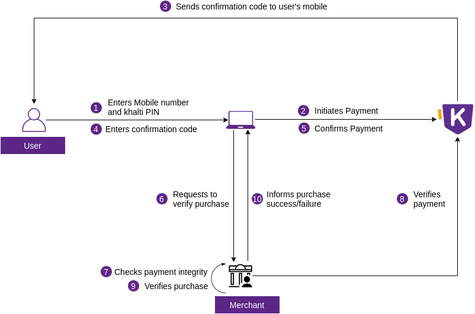

There are four steps for integrating Khalti payment to a merchant system.

- [1. Signup as a merchant and  as a User](#1-signup-as-a-merchant-and--as-a-user)
- [2. Understand Khalti payment process](#2-understand-khalti-payment-process)
- [3.  ePayment Gateway Integration](#3-test-integration)
	- [3.1. Web](#31-client-side-integration)
	- [3.2. Client side integration](#31-client-side-integration)

	- [4.1. Further processes](#41-further-processes)

## 1. Signup as a merchant and  as a User
First of all you will need a merchant and a consumer accounts.
**Merchant** is an online business service like e-commerce websites, ISP online payment, Movie online purchase etc.
**Consumer** is an end user who uses Khalti to purchase products or services from merchants.

Please follow links below to create a merchant and a consumer accounts if you have not already.

- [Create a merchant account](https://khalti.com/join/merchant/)
- [Create a consumer account](https://khalti.com/join/)

!!! info 

    For the latest version of Khalti Payment Gateway on web,
    Please visit <a href="/khalti-epayment">ePayment Checkout</a>

## 2. Understand Khalti payment process

## 3. ePayment Gateway integration
Now that you know how Khalti payment works. Its time to integrate it into your system.
A merchant must complete test integration using **test keys**. Test keys start with `test_`.

In test mode, transactions are sandboxed, which means fund is not moved from a consumer to the merchant.
Khalti must to be integrated at client and server.

**Payment via E-Banking and Debit/Credit card is not supported in the test environment.** After you successfully integrate wallet, you need not to concern about E-Banking and Card payment integration.
### 3.1. Web checkout 
web  checkout 
### 3.2. Client side integration
For now there is only one way to integrate Khalti at client side, through SDKs.
We have developed SDKs for every major plaforms and we call it `Checkout`.

Checkouts provide all the necessary UIs and perform necessary processes to initiate and confirm payment.

- [Android Kit](./checkout/android.md)
- [iOS Kit](./checkout/ios.md)
- [Flutter Kit](./checkout/flutter/khalti-checkout.md)

### 3.2. Server side integration
Before  thing pidx needs to generate and it is done throught Server side Post request , it has to be done by Khalti.

## 4. Go live
After successful integration test, live keys will be generated in the merchant dashboard. The merchant must **replace test keys with live ones**.
Live keys start with `live_X`. Replace `test_public_X` and `test_secret_X` keys with `live_public_X` and `live_secret_X` keys respectively.

### 4.1. Further processes
Even successful integration itself doesn't let you receive payments above NRs. 200 per transaction. Please fill KYC form and contact us at 9801165565/9801856440/9801165558/9801165557 to remove the limits and accept payments without restrictions.
