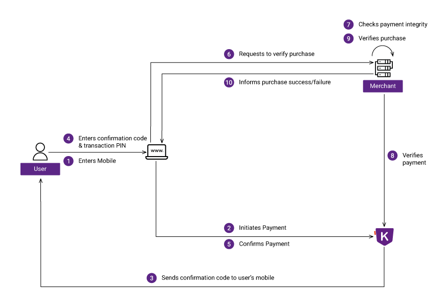

There are four steps for integrating Khalti payment to a merchant system.

- [1. Signup as merchant](#1-signup-as-merchant)
- [2. Understand how khalti payment works](#2-understand-khalti-payment-process)
- [3. Test integration](#3-test-integration)
	- [3.1. Client side integration](##3.1-client-side-integration)
	- [3.2. Server side integration](##3.2-server-side-integration)
- [4. Deploy integration](#4-deploy-integration)

## 1. Signup as merchant
First of all you will need a merchant and a consumer accounts.
**Merchant** is an online business service like e-commerce websites, ISP online payment, Movie online purchase etc.
**Consumer** is an end user who uses Khalti to purchase products or services from merchants.

Please follow links below to create a merchant and a consumer accounts if you have not already.

- [Create a merchant account](https://khalti.com/join/merchant/)
- [Create a consumer account](https://khalti.com/join/)

## 2. Understand Khalti payment process

## 3. Test integration
Now that you know how Khalti payment works. Its time to integrate it into your system.
A merchant must complete test integration using test keys. Test keys start with `test_`.

In test mode, transactions are sandboxed, which means fund is not moved from a consumer to the merchant.
Khalti must to be integrated at client and server. A transaction has three states initiate, confirm and complete. A client initiates and confirms payment while server verifies it and payment process is completed.

### 3.1. Client side integration
For now there is only one way to integrate Khalti at client side, through SDKs.
We have developed SDKs for every major plaforms and we call it `Checkout`.

Checkouts provide all the necessary UIs and perform necessary processes to initiate and confirm payment.

- [Web](./checkout/web.md)
- [Android](./checkout/android.md)
- [iOS](./checkout/ios.md)

### 3.2. Server side integration
After user confirms payment, it has to be verified by Khalti.
**Fund from user's account is moved to merchant only if verification succeeds.**
Verification must be done by the merchant server using a secret key.

- [Verification api](./api/verification.md)
- [Transaction api](./api/transaction.md)

## 4. Deploy integration
After successful integration test, the merchant must replace test keys with live ones.
Live keys start with `live_X_X`. Replace `test_public_X` and `test_secret_X` keys with `live_public_X` and `live_secret_X` keys respectively.
