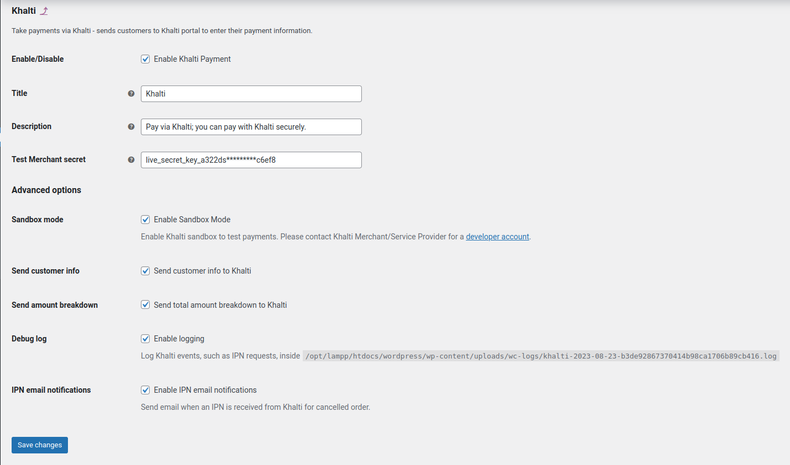

# WooCommerce

This is Khalti Payment Gateway extension for WooCommerce.
Check out the source for [Khalti plugin](https://github.com/khalti/khalti-woocommerce) on Github.

## Installation ##

The basic steps to follow:

- Go to the plugin section in your WordPress admin dashboard
- Click on Add New and upload the zip file of Khalti WooCommerce plugin ([link](https://wordpress.org/plugins/integrate-khalti-in-wc-store/)) and upload it or search Khalti in search

- After installation is complete, go to `WooCommerce > Settings`
- Go to `Payments` option where you can find Khalti among other payment gateways
- Click on Khalti option and enter your live secret key in respective fields. You can get keys from `Keys` section in your merchant dashboard [here](https://test-admin.khalti.com/#/)

- Click on save changes

## Testing ##

- Should enable khalti and Sandbox Mode as shown in above example.
- Currency should be Nepalese Rupee. ([How](https://docs.woocommerce.com/document/shop-currency/))
- Go to your shop and complete a transaction from Wallet payment type.

## Deploy ##

- If you complete the test, Go to keys section in your merchant account, you can get your Live keys ([here](https://admin.khalti.com/#/))
- Uncheck the Sandbox Mode and enter your secret key in respective fields

- Finally save the changes.
